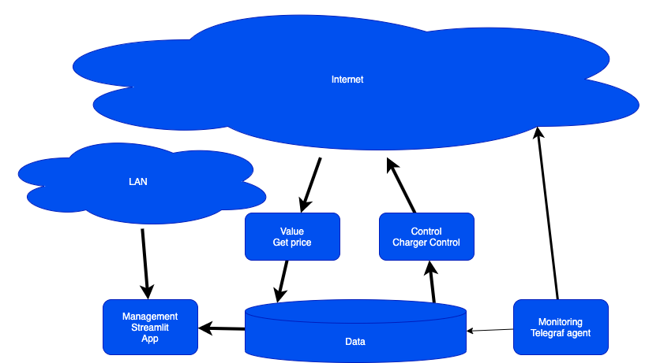

# Perfect Charge

An app, with the purpose,of getting the price of power, and then schelduling it on the charger.

Design will be based on a multi tier k8s app, as described below.

## Env Variables

The following enviromental variables, need to be set on the container, for it to work.

### Value
BARRY METER

BARRY_TOKEN

### Control

### Monitoring