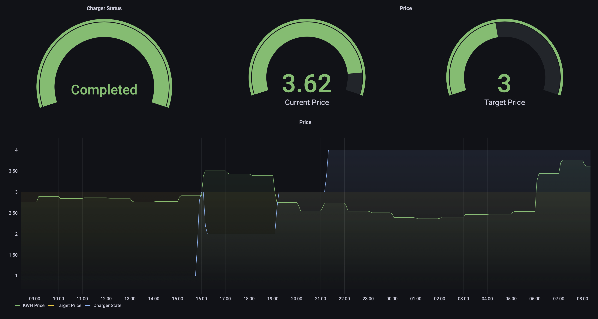

# Perfect Charge
## Deployment status
 - 

## Description

An app, with the purpose,of getting the price of power from [Barry](https://barry.energy/dk), and then schelduling it on an [Easee](https://easee.com) charger.

Design is based on a multi tier k8s app, as described below.
It could be done more simple, but the secondary purpose of this app, is to use it for for demo's for my work.

# Installation
## Env Variables / Secrets

The following enviromental variables, need to be set on the container, for it to work.
### Value

- BARRY_METER_ID
- BARRY_TOKEN
### Control

- EASEE_USER
- EASEE_PASSWORD

### Log

- GRAFANA_URLS
- GRAFANA_DATABASE
- GRAFANA_TIMEOUT
- GRAFANA_USERNAME
- GRAFANA_PASSWORD 

