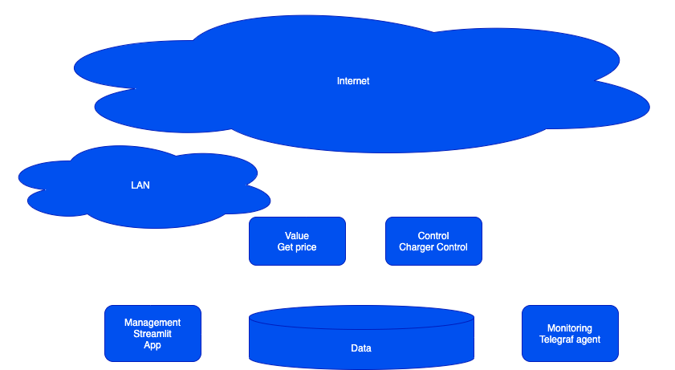

# Perfect Charge

An app, with the purpose,of getting the price of power from [Barry](https://barry.energy/dk), and then schelduling it on my [Easee](https://easee.com) charger.

Design will be based on a multi tier k8s app, as described below.

## Env Variables / Secrets

The following enviromental variables, need to be set on the container, for it to work.

### Value
exportBARRY_METER_ID
BARRY_TOKEN
### Control
EASEE_USER
EASEE_PASSWORD

### Log
GRAFANA_URLS
GRAFANA_DATABASE
GRAFANA_TIMEOUT
GRAFANA_USERNAME
GRAFANA_PASSWORD 
### Monitoring

